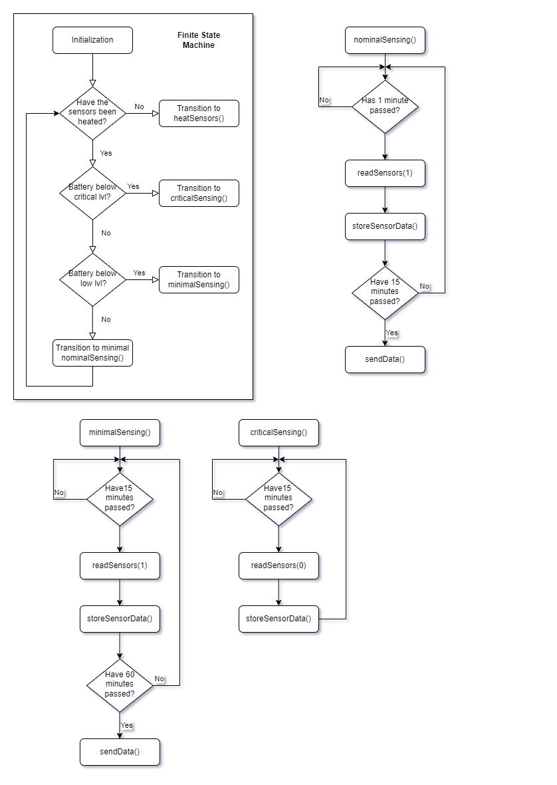
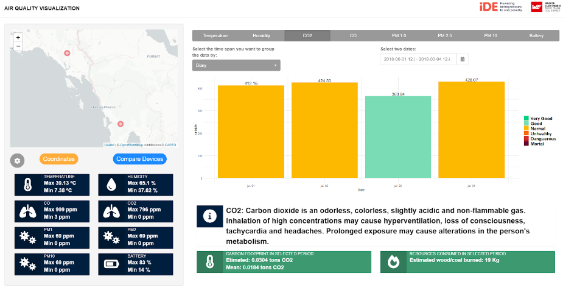

# Clean Cooking

The goal of this project is to make a solar-powered device tha measures air quality and gives the user visual feedback. The idea is that the user can place the device somewhere in their kitchen to constantly monitor the air quality with regards to carbon or wood kitchens. The device will also keep a record of the data and forward it to a server for historical representation of the data.

## Firmware

The device will be coded as a Finite State Machine that revolves around it's battery level. Being solar-powered, we don't want to burn through the battery life. This is why 4 states have been defined:
1. Sensor Heating: some electro-chemical sensors require pre-heating in order to give reliable measurments
2. Nominal Sensing: read sensors every minute, send data every 15 min
3. Minimal Sensing: read sensors every 15 minutes and send data every hour
4. Critical Sensing: turn off sensors excep Particle Mater sensor and store the data until transition to another state.

## Visualization Tool

Since multiple sensors are going to be deployed in different environmentes, a vizualization tool has been developed that lets the user view data in real time as well as historically.

